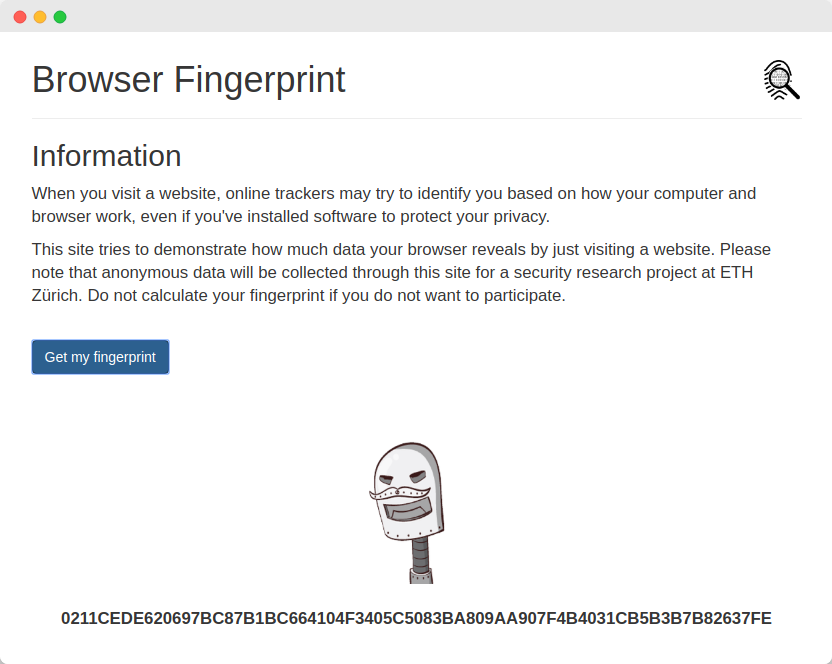

# Browser Fingerprint

Calculate your browser fingerprint, compare it with others and see how much data your browser reveals by just visiting a website.

  

## Development
The JavaScript library `fingerprintjs2` found in `src/` is forked from [fingerprintjs2](https://github.com/Valve/fingerprintjs2) and has been modified to use [TLSH](https://github.com/trendmicro/tlsh) instead of MurmurHash to provide similar hashes for similar inputs. This allows to compare fingerprints from different browsers.

Additionaly, various detectable browser features such as support for the Battery API and WebRTC have been added.

### Build
In the `src/` folder:

1. Run `npm install` and `npm build`
1. Install gulp-cli: `npm install gulp-cli -g`
1.. Run `gulp minify`

### Usage
Include all files from the dist/ folder on your website (including tlsh.min.js). Fingerprintjs2 usage can be found [here](https://github.com/Valve/fingerprintjs2).

## Acknowledgements
* [fingerprintjs2](https://github.com/Valve/fingerprintjs2)
* [tlsh-js](https://github.com/idealista/tlsh-js)
* [robohash.org](https://robohash.org/)
